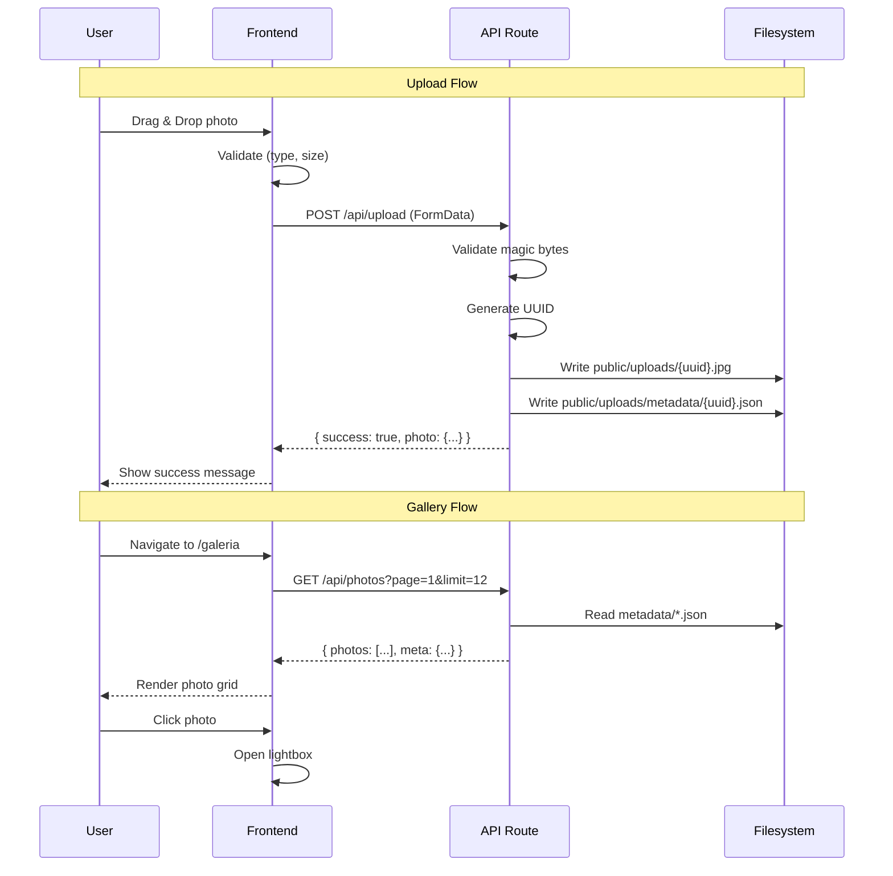

# FotoBook — Architecture Spine

## Paradigm

**Server-Side Rendered (SSR) + Client-Side Hydration**

Next.js 15 App Router com Server Components por padrão e Client Components apenas quando necessário (interatividade). API Routes server-side para upload e CRUD. Armazenamento local via filesystem com estrutura de metadados JSON.

> **Por quê?** Para um projeto pessoal de média complexidade, SSR + API Routes oferece o melhor equilíbrio entre simplicidade, performance e manutenibilidade. Sem necessidade de banco de dados externo no MVP.

---

## Architecture Decisions

### AD-1: Framework Principal
**Binds:** Todo o código frontend e API
**Prevents:** Uso de frameworks alternativos (Vite, CRA, Svelte)
**Rule:** Next.js 15.x com App Router é o framework único

```
[ADOPTED] Next.js 15 App Router
- Server Components por padrão
- Client Components apenas para interatividade
- API Routes para backend
- next/image para otimização de imagens
```

---

### AD-2: Estrutura de Diretórios
**Binds:** Localização de todos os arquivos
**Prevents:** Arquivos fora do padrão, imports circulares
**Rule:** Seguir convenção Next.js App Router

```
src/
├── app/                    # App Router (rotas)
│   ├── page.tsx           # /
│   ├── layout.tsx         # Layout raiz
│   ├── globals.css        # Estilos globais
│   ├── upload/            # /upload
│   ├── galeria/           # /galeria
│   └── api/               # API Routes
│       ├── upload/        # POST /api/upload
│       ├── photos/        # GET/POST /api/photos
│       ├── albums/        # CRUD /api/albums
│       └── tags/          # GET/POST /api/tags
├── components/            # Componentes React
├── lib/                   # Utilitários
└── types/                 # Tipos TypeScript
```

---

### AD-3: Armazenamento de Dados
**Binds:** Estrutura de persistência
**Prevents:** Uso de banco de dados externo no MVP
**Rule:** Filesystem + JSON para metadados

```
[ADOPTED] Filesystem Storage
public/
├── uploads/               # Arquivos de imagem
│   ├── {uuid}.jpg         # Fotos (renomeadas para UUID)
│   └── metadata/          # Metadados
│       └── {uuid}.json    # JSON com metadados da foto
```

**Trade-off:** Simplicidade vs. escalabilidade. Aceitável para uso pessoal.

---

### AD-4: Modelo de Dados
**Binds:** Estrutura de Photo e Album
**Prevents:** Schema incompatível entre componentes
**Rule:** Interfaces TypeScript compartilhadas

```typescript
// Fonte da verdade: src/types/index.ts
interface Photo {
  id: string;              // UUID
  filename: string;        // {uuid}.{ext}
  originalName: string;    // Nome sanitizado do original
  description: string;     // Máx. 500 chars
  tags: string[];          // Máx. 20 tags, normalizadas
  uploadedAt: string;      // ISO 8601
  size: number;            // Bytes
  mimeType: string;        // image/jpeg, etc.
  width?: number;          // Opcional (futuro)
  height?: number;         // Opcional (futuro)
  isPublic: boolean;       // Visibilidade
  isFavorite: boolean;     // Favorito
  albumId?: string;        // Reference to Album
}

interface Album {
  id: string;
  name: string;
  description?: string;
  coverPhotoId?: string;
  createdAt: string;
  updatedAt: string;
  photoCount: number;
}

interface Tag {
  id: string;
  name: string;
  slug: string;
  photoCount: number;
}
```

---

### AD-5: API Design
**Binds:** Contrato de API entre frontend e backend
**Prevents:** APIs inconsistentes, endpoints duplicados
**Rule:** REST convencional com Response padronizada

```
[ADOPTED] REST API com Response Pattern

Response Pattern:
{
  "success": boolean,
  "data": T | null,
  "error": string | null,
  "meta": {
    "page": number,
    "limit": number,
    "total": number,
    "totalPages": number
  }
}

Endpoints:
POST   /api/upload              → Upload de foto
GET    /api/photos               → Listar fotos (paginado)
GET    /api/photos/:id           → Detalhes de uma foto
PATCH  /api/photos/:id           → Atualizar metadados
DELETE /api/photos/:id           → Soft delete

POST   /api/albums               → Criar album
GET    /api/albums               → Listar albums
GET    /api/albums/:id           → Detalhes do album
PATCH  /api/albums/:id           → Atualizar album
DELETE /api/albums/:id           → Remover album
POST   /api/albums/:id/photos    → Adicionar fotos ao album

GET    /api/tags                 → Listar tags
POST   /api/tags                 → Criar tag
```

---

### AD-6: Upload Pipeline
**Binds:** Fluxo completo de upload
**Prevents:** Upload direto sem validação, armazenamento inseguro
**Rule:** Pipeline em 5 etapas

```
[ADOPTED] Upload Pipeline

┌─────────────┐
│  1. Receive │ FormData via API Route
└──────┬──────┘
       │
       ▼
┌─────────────┐
│  2. Validate│ MIME (magic bytes) + Size (10MB) + Type
└──────┬──────┘
       │
       ▼
┌─────────────┐
│  3. Process │ Generate UUID, sanitize filename
└──────┬──────┘
       │
       ▼
┌─────────────┐
│  4. Store   │ Save to public/uploads/{uuid}.{ext}
└──────┬──────┘
       │
       ▼
┌─────────────┐
│  5. Metadata│ Save JSON to public/uploads/metadata/{uuid}.json
└─────────────┘
```

**Security Measures:**
- Magic bytes validation (não confiar em Content-Type)
- UUID filename (prevenir directory traversal)
- Size limit check antes de escrever em disco
- Rate limiting no endpoint

---

### AD-7: Frontend State Management
**Binds:** Como o estado é gerenciado
**Prevents:** Redux desnecessário, estado global não controlado
**Rule:** React State + Context para estado global mínimo

```
[ADOPTED] Local State + Minimal Context

Component-level:
- useState para estado local
- useCallback para memoização
- useEffect para side effects

Global-level (se necessário):
- React Context para tema/configurações
- Não usar Redux/Zustand no MVP

Server State:
- fetch + cache para dados da API
- SWR ou React Query (futuro)
```

---

### AD-8: Estilização
**Binds:** Sistema de design e estilos
**Prevents:** CSS-in-JS desnecessário, estilos inline extensivos
**Rule:** Tailwind CSS 4.x como sistema de design

```
[ADOPTED] Tailwind CSS 4.x

Design Tokens (CSS Variables):
--primary: #2563eb
--success: #16a34a
--error: #dc2626
--warning: #f59e0b
--muted: #737373
--border: #e5e7eb

Component Patterns:
- Utility-first classes
- Responsive: sm: md: lg:
- Dark mode: prefers-color-scheme
- Animations: animate-*, transition-*
```

---

### AD-9: Imagem e Performance
**Binds:** Como imagens são servidas e otimizadas
**Prevents:** Imagens grandes sem otimização, carregamento eager
**Rule:** next/image + lazy loading + blur placeholder

```
[ADOPTED] Image Optimization Pipeline

Upload:
1. Original preservado em public/uploads/
2. Thumbnail gerado (300px) - futuro
3. blurDataURL gerado - futuro

Display:
- next/image com priority para above-the-fold
- loading="lazy" para below-the-fold
- placeholder="blur" com blurDataURL
- sizes responsivo baseado no layout

Formats:
- Browser decide (AVIF > WebP > JPEG)
- next/image serve formato ideal automaticamente
```

---

### AD-10: Deploy e Ambiente
**Binds:** Como o app é deployado
**Prevents:** Deploy manual, configuração inconsistente
**Rule:** Coolify com Docker + standalone output

```
[ADOPTED] Coolify Deployment

next.config.ts:
- output: "standalone"
- serverActions.bodySizeLimit: "10mb"

Docker:
- Multi-stage build (futuro)
- Node.js 20 runtime
- Non-root user

Environment:
- NODE_ENV=production
- PORT=3000
- UPLOAD_DIR=./public/uploads
```

---

## Component Diagram

```mermaid
graph TB
    subgraph "Frontend (Browser)"
        UI[Next.js App]
        Upload[Upload Page]
        Gallery[Galeria Page]
        Lightbox[Lightbox Modal]
    end

    subgraph "Backend (Next.js API Routes)"
        API[/api/upload]
        Photos[/api/photos]
        Albums[/api/albums]
        Tags[/api/tags]
    end

    subgraph "Storage"
        FS[Filesystem]
        Uploads[public/uploads/]
        Metadata[public/uploads/metadata/]
    end

    UI --> Upload
    UI --> Gallery
    Gallery --> Lightbox

    Upload --> API
    Gallery --> Photos
    UI --> Albums
    UI --> Tags

    API --> FS
    Photos --> FS
    Albums --> FS
    Tags --> FS

    FS --> Uploads
    FS --> Metadata
```

---

## Data Flow Diagram



---

## Security Model

```
┌─────────────────────────────────────────────────────────────┐
│                    Security Layers                          │
├─────────────────────────────────────────────────────────────┤
│ Layer 1: Input Validation                                   │
│ - MIME type (magic bytes)                                   │
│ - File size (10MB max)                                      │
│ - Content sanitization                                      │
├─────────────────────────────────────────────────────────────┤
│ Layer 2: File System Protection                             │
│ - UUID filenames (no user input in paths)                   │
│ - Upload directory isolation                                │
│ - No web server access to metadata dir                      │
├─────────────────────────────────────────────────────────────┤
│ Layer 3: API Security                                       │
│ - Rate limiting (upload endpoint)                           │
│ - CORS configuration                                        │
│ - Input length limits                                       │
├─────────────────────────────────────────────────────────────┤
│ Layer 4: Privacy                                            │
│ - EXIF GPS stripping (default)                              │
│ - User-controlled visibility                                │
│ - LGPD compliance                                           │
└─────────────────────────────────────────────────────────────┘
```

---

## Deferred Decisions

| Item | Reason | Revisit When |
|------|--------|--------------|
| Database (PostgreSQL) | Filesystem sufficient for MVP | > 1000 photos or multi-user |
| Cloud Storage (S3/R2) | Local storage works for self-hosted | Scalability needed |
| Authentication | Personal use, single user | Multi-user or public access |
| CDN | Self-hosted, single location | Performance issues |
| Caching Strategy | Simple app, low traffic | Performance bottlenecks |
| Testing Framework | MVP first, tests later | Stable features complete |

---

## Open Questions

| # | Question | Impact | Owner |
|---|----------|--------|-------|
| 1 | Should we add authentication for MVP? | Security | Humberto |
| 2 | When to migrate from filesystem to database? | Scalability | Humberto |
| 3 | Should albums support nested sub-albums? | Complexity | Vânia |

---

## Constraints (Inherited from PRD)

- Maximum 10MB per photo
- Supported formats: JPG, PNG, GIF, WEBP, HEIC
- Maximum 20 tags per photo
- Description maximum: 500 characters
- Self-hosted via Coolify
- Node.js >= 20.12

---

*Architecture Spine v1.0*
*Generated via BMAD Method*
*Autor: Buffy (Codebuff)*
*Data: 2026-09-07*
